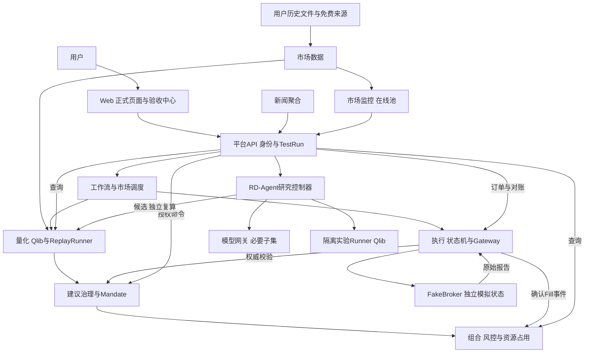

# 整体架构设计

日期：2026-09-07。状态：设计/NOT_RUN。配套[索引](./README.md)、[契约](./02-contracts-and-data.md)与[部署](./03-deployment-and-operations.md)。

## 1. 目标与边界

面向个人A股/美股现金多头、日/周/月低频策略。本轮V1～V3交付研究、历史回测、真实时钟Paper、Web验收和Ubuntu迁移；不接真实券商（含只读与券商模拟API）或LIVE。两市场身份/日历/币种独立，A股实际数据优先，美股Fixture完整基础闭环不等于真实数据验证。

按领域服务拆分Monorepo，事实唯一所有者，各域独立数据库/User/迁移。可在一个PostgreSQL实例上建多库，Compose按阶段启用，默认计算并发1；不要求一次启动所有可选服务。

## 2. 系统关系

下图为本轮模拟链路，箭头代表调用或事件，不代表跨库读写。

NATS承载Outbox事件及Inbox去重，Temporal保存编排步骤/等待，Artifact存储承载行情/模型/代码/报告。完整领域服务清单见索引；Web、FakeBroker、Runner另有组件设计。

## 3. 关键流程

模拟交易：固定数据→Qlib目标→治理策略/证据校验→组合全Leg风控和占用→人工批准或预批准Mandate判定→短期授权→执行原子接受→Gateway最后校验→FakeBroker报告→归一化Fill→组合入账/结算→对账/Outcome。HOLD无交易腿、不消费次数；采样与执行窗口独立。

跨域预留使用Saga：治理预算、组合资源、执行接受各自本地事务，通过稳定请求ID/查询/事件收敛。响应丢失保留DISPATCHING/UNKNOWN，不能假设失败释放资源。正常本批Fill推进ledgerVersion后重检剩余交易，非预期变化需重新评估。

历史回放：量化Worker持有Manifest/行情游标/Clock，通过相同治理、风控、执行和账本端口逐时刻推进；历史成交模型归执行域，FakeBroker维护独立模拟状态。详见[回放设计](./04-historical-replay.md)。

研究晋升：研究控制器→模型网关→隔离代码实验→候选→量化独立复算→用户批准精确版本→模拟策略/Mandate。研究不具备Registry批准权，生成代码无交易权限或控制器秘密。

## 4. 分层与事实所有权

后端按domain/application/ports/adapters/bootstrap组织，框架/DB/Qlib/RD-Agent SDK在Adapter。共享包仅包含生成契约、纯规则和工具，不保存跨域可变业务状态。

| 事实 | 唯一所有者 |
|---|---|
| 证券/日历/行情/数据版本/公司行动来源 | market-data-service |
| 历史池/模型/策略Registry/回测报告/Outcome | quant-research-service |
| 账户/Lot/现金/结算/风险/资金证券占用 | portfolio-risk-service |
| 建议/审批/Mandate/交易次数预算/执行授权 | decision-governance-service |
| Order/Fill/原始回报/发送日志/对账案例 | trade-execution-service |
| 调度定义/工作流配置 | workflow-orchestration-service，步骤状态在Temporal |
| 身份/平台审计/TestRun/人工验收 | platform-api-service |
| 新闻、监控池、市场状态、模型调用、研究实验 | 各自服务，见对应文档 |
| 独立模拟券商订单/资产/故障状态 | FakeBroker组件 |

模型网关拥有ModelRun与实际调用费用，研究域拥有实验预算分配/调用引用，不重复计费。策略批准归量化、执行批准归治理、开发人工验收归平台，三者不能替代。

## 5. 三版演进与进程边界

V1.1启平台/组合/DB/Artifact/Web；V1.2启数据/量化/Qlib；V1.3启治理/执行/FakeBroker与事件；V1.5完成真实Temporal/NATS恢复。V2增加免费来源/新闻/监控、分钟回放及模型验证。V3启研究/Runner与模型网关必要子集，迁移实际Ubuntu。完整市场状态和六角色Agent默认关闭。

API与计算/事件Worker可独立进程，仍属于同一领域服务和数据库所有权。每服务S0～S6依次冻结契约、骨架、真实纵向持久化、领域、事件、强化和发布证据。每阶段同时完成正式Web/验收中心及可执行手册。

## 6. 故障和验证

无法验证身份、风险、行情、账户、授权时拒绝新交易，继续处理合法确认Fill和权威查询。UNKNOWN不等于失败，暂停不等于已撤销在途。价格/币种/结算/PIT按原契约，RAW撮合和复权/公司行动不得双算收益。

具体依赖版本、容器端口、DDL、扩展路由和性能预算在对应S0/阶段实测冻结；本目录是设计输入，不是已部署系统。验证沿用T01～55适用模拟项及VT01～07，必须包括真跨服务/重启/无浏览器/双市场/回放/沙箱证据。
