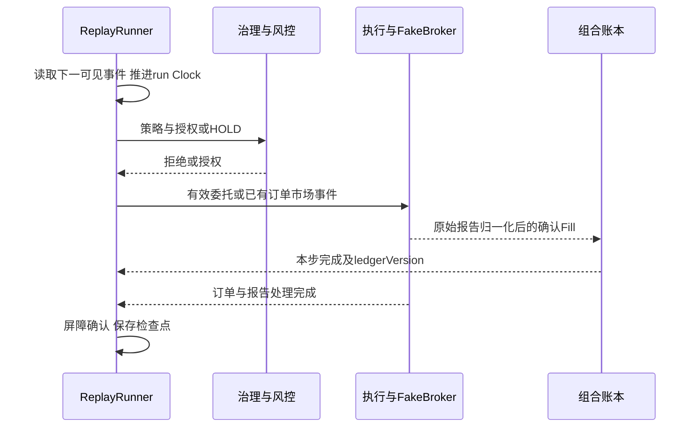

# 历史事件回放与分钟撮合设计

状态：设计/NOT_RUN。V1预留Clock/日线回测，V2.2～2.3实现分钟导入与回放。配套[量化](./services/quant-research-service.md)、[执行](./services/trade-execution-service.md)、[FakeBroker](./components/fake-broker.md)。

## 1. 所有权和成交生成

量化拥有ReplayManifest/游标/Clock/检查点/报告；执行拥有订单状态机和历史模型；FakeBroker维护独立模拟券商状态；组合拥有账本；治理拥有预算/授权。Temporal只管理粗粒度任务。

ReplayRunner经受控端口传run和数据版本绑定的市场事件。撮合实现归执行域，可通过同一版本化纯计算包注入FakeBroker；每run只有一条成交生成路径：FakeBroker原始报告→执行归一化→组合入账，不能Qlib与FakeBroker各自重复产生Fill。

Qlib快速研究报告与全链路回放标不同模型。若为性能进程内复用纯领域库，须与真实服务小样本对照通过，不能仅口头宣称等价。

## 2. 固定输入

Manifest冻结run/namespace、市场/初始账户、历史股票池、日线/分钟DataVersion、日历/规则/策略/成本/代码/镜像、训练/验证/测试、seed/故障序列、执行模型/容差。

MinuteBar明确barStart/barEnd/availableAt、securityId/market/frequency、RAW OHLCV/amount及单位、来源/质量/状态限制引用。完整Bar在结束前不能用于决策，必要证据缺失拒绝相应撮合或明确限制用途。

## 3. 推进与屏障

同刻按冻结的事件类型优先级/证券稳定ID/序号排序；日历/公司行动/结算、Bar可见、已有订单撮合、新信号先后顺序在S0明确。新订单不回填到提交前Bar。HOLD/拒绝也有步骤完成确认，不等待不存在的Fill。

每stepId有预期工作与报告确认集合，所有副作用收敛才推进；不能sleep猜测完成。真实超时暂停/报错，不通过推进虚拟Clock掩盖未完成工作。

## 4. 模型限制

DAILY_BAR日线、MINUTE_BAR实际历史分钟、SNAPSHOT稀疏实际采样分别报告。固定限价DAY、参与率、滑点、费用、会话、过期/部分成交模型。

收盘信号最早下一可交易时点；完整分钟量额/窗口VWAP只能事后作执行模型，不能在窗口开始预知。涨跌停触价不保证排队成交；分钟数据未知盘口/高低先后，采用版本化保守假设。缺分钟/零量/状态未知不前填成交。

RAW撮合、复权研究、公司行动入账分开；CN可卖量与US付款/结算分别按有效规则。模拟授权/资源仍复用同样业务不变量。

## 5. 检查点与取消

稳定检查点保存已完成step、游标、Clock、seed/故障事件、待处理事件及各域确认版本，仅在屏障完成后提交。中途崩溃先用原命令/事件ID查询/重试收敛未完成步骤，再推进。新建账户重头跑不是断点恢复。

暂停到一致边界；取消停止新步骤并收敛已接受命令/合法Fill，保存取消及部分诊断产物，不发布完整成功报告。跨run的Clock/账户/缓存/事件/Artifact隔离，默认计算并发1。

## 6. 验证

验证同Bar泄漏、VWAP、零量/限制价/部分成交/撤单、费用/公司行动、UNKNOWN、跨日结算、同刻顺序、双run隔离及恢复与不中断一致。资金精确、研究容差预定义。

Web显示时钟/进度、暂停继续、Bar与订单/Fill对照、现金/净值/费用/拒绝和覆盖。操作与命令见[V2.3手册](../docs/prd/v2-data-and-replay/03-historical-minute-replay.md)，所有业务验证当前NOT_RUN。
