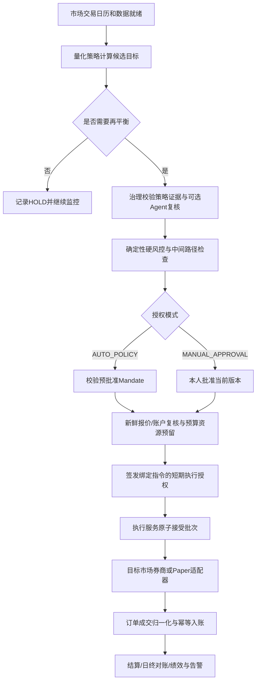

# 个人A股与美股低频量化自动交易平台 PRD

版本：2.0 · 日期：2026-09-06 · 定位：从零创建新项目的独立产品基线。

本产品仅供所有者本人使用，最终交付必须支持A股与美股的低频量化自动交易。本文和同目录配套文件构成完整开发依据，不依赖任何目录外的项目文件、代码、阶段记录或配置。全部功能为待实现目标；没有预设可复用实现。

## 1. 产品目标与已确认范围

### 本轮交付覆盖（2026-09-07补充）

本轮按[三版共同规则](./05-three-version-delivery.md)及V1～V3文件夹执行：Mac M1小数据真实Qlib与模拟闭环、免费行情/新闻和历史分钟回放、RD-Agent研究与Ubuntu迁移。每阶段同步正式Web和长期保留的开发验收中心，支持正常/异常场景、独立自动断言与人工签署。

本轮所有券商、账户同步、订单和成交均使用自有FakeBroker，不接真实券商（含只读与券商模拟账户API），LIVE写关闭。A股真实数据优先，美股基础链路用Fixture验收。在线池≤100，默认30分钟、可选20分钟盘中快照采样，日线收盘确认与策略/执行窗口分离；本轮覆盖原MON-02的10分钟默认，后者留作后续配置扩展。

新增DV-01～07的业务行为和验收写在共同规则第2～9节，追踪见[矩阵](./01-feature-traceability.md)，对应VT01～07。原R0～R3/124条功能保留长期目标，V1～V3不代表全部原需求完成；具体排除项见共同规则第1节。

### 1.1 最终产品

建立“获取数据→量化计算→组合目标→硬风控→自动授权→券商执行→成交结算→对账→绩效复盘”的长期运行系统。用户事先配置并批准策略和自动运行边界，系统在授权范围内自动交易，无需每次手工批准或回填。

日频或周/月频计算、持仓通常跨多个交易日，允许数周不交易。模型和新闻解释属于可选分析能力；核心交易信号由版本化量化策略生成，金额、仓位、风控、授权和执行均由确定性代码决定。

已确认：个人使用；同时面向A股与美股；目标为低频自动实盘；全新开发；本目录可以单独复制作为开发依据。回测、Paper和Shadow是交付过程中的验证方式，不能成为替代最终自动交易目标的终点。

### 1.2 默认范围与待定边界

| 项目 | 新项目默认设计 |
|---|---|
| 用户 | 单一所有者，可使用多账户/多策略；无需商业多租户和双人审批 |
| A股 | 沪深交易所上市普通股票；具体板块由白名单与账户权限控制；北交所为待确认扩展 |
| 美股 | NYSE/Nasdaq普通股票；ETF/ADR、OTC、优先股、复杂公司行动分别准入，默认不自动开放 |
| 仓位 | 现金账户、多头、不杠杆、不卖空；有保证金账户也默认禁止融资使用 |
| 币种 | 按账户保留CNY/USD原币账本；汇率用于汇总展示，不自动兑换资金 |
| 时段 | 两市场各自常规交易时段；美股盘前盘后、隔夜及特别交易时段默认关闭 |
| 策略 | 日频评估、低换手再平衡；NO_TRADE基准与低换手TopK优先 |
| 委托 | 首版以限价DAY为基础；订单类型、数量精度与撤改支持由券商能力声明 |
| 自动化 | AUTO_POLICY为目标常态；MANUAL_APPROVAL用于试运行、例外和接管 |
| 部署 | 开发机可本地运行；实盘必须在覆盖两个市场交易时段的常开主机上运行 |
| 数据/券商 | 分市场Adapter，无预设供应商；实际合法可用接口在接入前确认 |

默认设计可由所有者在开发前调整，不表示已知其真实资金、风险承受能力或券商权限。投资绩效不作未经验证的收益承诺。

### 1.3 非目标

首个完整版本不建设高频交易、盘口做市、杠杆/期权/期货、跨市场套利、资金自动跨境划拨、自动换汇、面向公众提供投顾、多租户收费服务。策略自动执行不等于策略自动改写；研究或Agent生成的新策略必须独立验证并经本人激活。

## 2. 文档包与使用方法

| 文件 | 内容 |
|---|---|
| [阅读入口](./README.md) | 新项目启动方法与确认项 |
| [本文](./00-product-requirements.md) | 产品定位、范围、完整功能、页面和业务规则 |
| [需求追踪](./01-feature-traceability.md) | 逐项功能→责任域→测试→交付版本 |
| [架构设计](./02-system-architecture.md) | 服务边界、基础设施、部署、事实所有权与降级 |
| [双市场与契约](./03-market-rules-and-contracts.md) | 日历、结算、币种、订单、授权、事件和错误协议 |
| [实施计划](./04-development-plan.md) | 从空目录开始的分阶段任务、文件、顺序与门禁 |
| [测试计划](./90-test-plan.md) | 逐层及端到端场景 |
| [验收清单](./99-acceptance.md) | 自动交易完整产品验收和发布证据 |

同目录间链接是唯一内部文档依赖。代码目录名和命令均为新项目待创建的目标结构，不代表文件已存在。外部链接仅用于核对交易所/监管事实，开发所需产品规则与接口语义写在本包中。

## 3. 用户操作与自动化模式

### 3.1 用户故事

1. 我能分别连接A股和美股账户，核对持仓、已结算现金、市场权限和数据可用性。
2. 我能按市场选择策略、历史区间、基准和成本模型，比较回测/Paper/Shadow的风险收益。
3. 我能一次配置自动授权范围：账户、市场、策略版本、证券范围、资金限额、时间窗及停止条件。
4. 已启用的策略在交易日自动完成调仓与对账，我查看结果和异常即可，不必打开页面或逐单点击。
5. 我能一键暂停全部或单个市场，检查未知订单，处理例外；恢复前系统先核对事实。
6. 我能看到按市场、策略、原币和统一报告币种的收益，以及价格收益、费用、税费与汇率影响。

### 3.2 两组互相独立的模式

环境模式：BACKTEST、PAPER、SHADOW、LIVE。授权模式：MANUAL_APPROVAL、AUTO_POLICY。决策方式：QUANT_ONLY、AGENT_ASSISTED。

例如LIVE+AUTO_POLICY+QUANT_ONLY是完整有效的目标产品运行方式；PAPER+AUTO_POLICY可验证无人逐笔审批链路。MANUAL_APPROVAL不得成为所有LIVE交易的固定等待步骤。切换模式必须受权限校验、版本化与审计，不允许故障时临时跳过原本必需的Agent或审批。

### 3.3 人员与服务权限

本人可具有查看、研究、策略激活、风险配置、授权管理、执行接管和运维权限，但每次操作明确动作与范围。服务分别授权：量化只发布目标；治理签发授权；组合风险管理资金和占用；执行连接券商；Agent只能调用已授予Tool。前端自填身份/角色不构成可信认证。

### 3.4 自动授权与例外

本人发布AutomationMandate，指定账户/市场/策略精确版本、证券范围、最大资金/仓位/换手/批次、交易时段、有效期、异常动作及通知渠道。每个信号依然经过硬风控、资源与预算预留，再自动生成绑定当前指令的ExecutionAuthorization。

超出Mandate不能静默缩单或放宽规则：根据已配置规则确定性重算新建议、转人工或拒绝。人工也不能覆盖硬风控；若扩大授权必须发布新Mandate。授权暂停/撤销后新发送立即阻断，已有订单仍查询与对账。

## 4. 交付版本与成功指标

### 4.1 产品版本

| 版本 | 必需交付 | 完成含义 |
|---|---|---|
| R0 双市场确定性闭环 | 两套日历/规则Fixture、双币账本、策略/风控、Paper、人工与自动授权、重启恢复、基础Web | 新项目基础能力可运行，不构成真实市场验收 |
| R1 真实数据与连续模拟 | 两市场授权数据、历史回测、真实时钟Paper/Shadow、账户只读同步、持续对账、执行报价质量 | 在真实市场时序下连续验证，策略和通道待实盘准入 |
| R2 双市场自动实盘 | 两市场各至少一个可用券商通道、预授权自动发送/撤单/成交/结算、常开部署、监控恢复与本人启用 | 本项目主要目标完成；只有一个市场通过则是局部交付 |
| R3 可选研究增强 | Agent分析、第三方插件、自动研究、记忆/学习、多策略复杂合并 | 增强能力，不阻塞QUANT_ONLY的R2 |

P0对应基础硬能力，P1对应真实数据与日常分析，P2对应自动实盘，P3对应可选增强。P1新闻/市场状态等仅在策略声明依赖时成为该策略门禁；双市场数据、行情质量、账户/结算、风险和对账不可省略。所有已启用功能的硬安全规则立即适用。

### 4.2 指标

- 任一市场未授权下单、重复成交入账、超卖、跨币种挪用资金次数为0。
- 100%接受批次具备可追溯策略版本、证据、Mandate或人工批准、风控、资源占用与成交记录。
- AUTO_POLICY有效范围内的端到端用例不等待人工、不依赖网页在线；重复触发不重复下单。
- 每市场连续60个模拟交易日HOLD均不产生委托或预算消耗；日频评估无最低交易频次。
- 分别报告每市场策略成本后收益、基准超额、回撤、换手、成交偏差；不混合模拟与真实业绩。
- 建议R1每市场至少20个交易日Shadow覆盖；无信号时用隔离故障场景验证执行，不能为测试强迫真实下单。
- R2观察期、风险限额和资金范围由本人确认；安全硬门禁无条件通过后方可启用。

## 5. 完整业务流程

### 5.1 初始化与上线

建立可信本地/远程身份→选择市场和账户→验证数据及券商能力→只读同步初始资产→核对结算与成本→建立策略和风险配置→回测→Paper/Shadow→本人批准策略与Mandate→按市场启用自动运行。

期初导入具备预览、错误行、唯一来源和幂等键。已有券商订单必须先认领/隔离和对账；不能启动时把账户当空仓。开发Fixture在单独命名空间；重置只创建新的模拟运行，不删除实盘账本。

### 5.2 日常自动交易

不同市场独立触发；跨市场信息仅使用decisionAsOf之前可见的数据。收盘后产生信号不能回填为同日已结束时刻成交。过时任务不在恢复时集中补下，先检查交易窗口、建议有效期、账户和策略版本。

### 5.3 盘中异常和人工接管

价格/流动性/新闻异常→质量与严重度门控→观察、延迟、撤单或已授权风险减仓。自动化只在既定策略内行动；一般波动不能增加未批准Alpha。严重故障暂停对应账户/市场；系统级身份、数据库或全局风控故障可暂停全部。

接管页面显示所有在途订单、剩余资金占用、暂停原因、最后对账和授权范围。撤单必须拿到确认；部分成交与迟到回报继续入账。UNKNOWN按原clientOrderId查询，不用新幂等键重新发送。

## 6. 完整功能需求目录

每条需求包含可观察结果和最小验收。功能域与服务、测试映射见配套追踪表；表内状态均为目标需求，不是当前完成率。

### 6.1 SYS：初始化、配置与运行模式

| ID/优先级 | 功能 | 业务行为及失败处理 | 最小验收 |
|---|---|---|---|
| SYS-01 P0 | 启动预检 | 检查运行时、端口、磁盘、迁移与依赖；按组件显示阻塞项 | 缺数据库时显示阻塞原因，不误报全栈健康 |
| SYS-02 P0 | 模拟初始化 | 版本化初始资金、持仓批次、数据、时钟、种子和账户 | 同一初始化键重复执行10次只初始化一次 |
| SYS-03 P0 | 模式隔离 | 区分LOCAL_SIM、PAPER、SHADOW、MANUAL、LIVE；输出记录模式 | 模拟数据不能成为LIVE授权输入 |
| SYS-04 P0 | 配置中心 | 风险、成本、策略、监控、模型、时钟配置版本化并可比较 | 配置变更不重写旧报告，失效范围可查询 |
| SYS-05 P0 | 暂停与恢复 | 全局/组合暂停、任务查询、受控恢复、隔离模拟重置 | 暂停后无新接受批次；已有成交继续入账 |
| SYS-06 P1 | 导入导出 | CSV/JSON导入预览、逐行错误和原始Hash；导出报告与证据清单 | 错误行不静默丢弃；交易CSV防公式注入 |

### 6.2 DAT：市场数据、证券、PIT和质量

| ID/优先级 | 功能 | 业务行为及失败处理 | 最小验收 |
|---|---|---|---|
| DAT-01 P0 | 证券主数据 | 稳定SecurityId、历史代码/名称、市场、板块、上市退市、状态和行业 | 历史更名仍关联同一证券；未支持品种拒绝执行 |
| DAT-02 P0 | 双市场交易日历 | 按Asia/Shanghai与America/New_York维护交易日、交易时段、休市/提前收盘、夏令时和结算日历 | 美股夏令时前后UTC调度正确；两个市场独立日切 |
| DAT-03 P0 | 数据版本 | 固定来源/Fixture版本、不可变原始Artifact、Hash、覆盖范围和许可引用 | Hash错误或部分归档拒绝发布；重复导入幂等 |
| DAT-04 P0 | 标准行情 | 原价、复权因子、OHLCV、成交额与来源字段分离 | 复权价不得直接作为实际成交价；单位明确 |
| DAT-05 P0 | 质量报告 | 缺失、重复、异常值、日历、范围、停牌、来源冲突与质量等级 | FAIL不可发布可用版本；WARN不包装为正常 |
| DAT-06 P0 | 缺失与状态解释 | 未知行情标UNKNOWN；可选研究假设掩码必须SIMULATION_ONLY或RESEARCH_ONLY，不能推断已确认停牌 | 不前向填充伪造可成交价格；假设数据不能授权实盘 |
| DAT-07 P1 | 双市场真实数据导入 | 按市场选择授权来源，经统一Adapter采集版本化日线、公司行动、指数及执行报价 | A股和美股均能独立导入；来源变更产生新DataVersion |
| DAT-08 P1 | 状态增强与对账 | 保存停复牌、风险警示、上市状态和交易限制的权威证据；批次可暂停、限速、续跑 | 假设与确认状态分开；未知状态证券不能执行 |
| DAT-09 P1 | 财务PIT | 报告期、公告、可见时间、修订链及原文证据分开存储 | 查询时availableAt不晚于asOf；更正不覆盖原值 |
| DAT-10 P1 | 供应商与漂移 | 维护主备来源、许可、配额、字段映射和来源优先级，财经原文与结构化数据可核对 | 单源故障不静默混用口径；缺市场必须数据则停止该市场策略 |
| DAT-11 P0 | 版本化查询 | 按SecurityId、DataVersion、asOf精确读取，保留历史索引 | 缺失返回明确NOT_FOUND，不回退到未知最新值 |
| DAT-12 P1 | 公司行动 | 分红、送转、拆合股、退市等建立可见时间与生效时间 | 数据修订与账户入账可关联，历史收益不重复复权 |

### 6.3 QNT：量化分析、因子、模型与回测

| ID/优先级 | 功能 | 业务行为及失败处理 | 最小验收 |
|---|---|---|---|
| QNT-01 P0 | 历史股票池 | 版本化范围、上市天数、ST、停牌、流动性过滤；保留历史退市样本 | 不用今天的股票列表回测历史 |
| QNT-02 P0 | 价格因子 | 动量、波动、流动性基线；明确回看窗口、公式、方向、缺失规则 | 固定样本手算一致，缺失不得用未来值补齐 |
| QNT-03 P1 | 价值/质量因子 | 估值、财务质量按字段PIT门禁逐步启用 | 缺历史估值或财务修订证据不得生产激活 |
| QNT-04 P0 | 因子变换 | 去极值、标准化、行业/市值中性化和变换版本 | 训练参数与历史可见截面一致，结果Hash稳定 |
| QNT-05 P0 | Registry | Factor/Model/FactorSet版本、实验、验证、批准、生效与退役 | 候选不能进入生产集合，停用有历史记录 |
| QNT-06 P1 | 模型训练 | 时间切分、训练验证测试、滚动验证、模型文件与指标 | 测试区间不参与调参；可重建训练输入 |
| QNT-07 P0 | 分析快照 | 候选股和持仓股评分、排名、分位、因子贡献、风险与证据 | 结果原子发布；失败保留上一版本并标陈旧 |
| QNT-08 P0 | 基础回测 | 同一执行规则、现金、可卖量、成本、滑点、部分成交 | 信号可见前不成交，成本后收益可与流水核对 |
| QNT-09 P1 | 评价与比较 | IC/RankIC、覆盖、换手、回撤、基准、样本外、参数敏感度 | 时间窗口和基准一致；报告包含被拒绝和缺失样本 |
| QNT-10 P0 | 任务与Artifact | 长计算异步、进度、取消、失败原因、代码/依赖/输入版本 | 取消计算不发布半份快照，结果可重跑 |

### 6.4 STR：日频策略与插件

| ID/优先级 | 功能 | 业务行为及失败处理 | 最小验收 |
|---|---|---|---|
| STR-01 P0 | 基准策略 | NO_TRADE、低换手TopK；保留区间、最低持有期、冷却和换手阈值 | 信号不满足阈值时NO_REBALANCE；不强制补足交易 |
| STR-02 P1 | 扩展内置策略 | 多因子质量、市场状态叠加；后者只建议适用分支 | 数据门禁不足时不可激活；不自动改RiskPolicy |
| STR-03 P0 | 策略版本 | 定义、参数Schema、数据依赖、代码Hash、成本和再平衡规则 | 任一参数变动生成版本，旧审批不自动继承 |
| STR-04 P0 | 策略快照 | 当前/目标权重、建议变化、预期换手、成本、理由与有效期 | NO_REBALANCE无伪交易腿；全组合质量一致 |
| STR-05 P3 | Plugin SDK | metadata/parameter_schema/validate_context/generate；只读Artifact输入 | 新插件不改Agent、Workflow和治理状态机 |
| STR-06 P3 | 隔离与供应链 | 第三方独立Runner、无外网/生产密钥、锁依赖、SBOM和许可审核 | 越权、超时、OOM被隔离；不影响其他策略 |
| STR-07 P3 | 确定性合并 | Ensemble采用版本化权重、相关性、集中度和换手约束 | 相同输入同结果；LLM无临时改权权限 |
| STR-08 P1 | 策略准入/暂停 | 验证→批准→生效→暂停/退役；策略证据可失效传播 | CANDIDATE和暂停版本不进入新生产决策 |

### 6.5 RES：自动研究

| ID/优先级 | 功能 | 业务行为及失败处理 | 最小验收 |
|---|---|---|---|
| RES-01 P3 | 研究假设 | 人工或学习Agent提交假设、数据、基准、预算和样本范围 | 缺数据版本或预算不开始实验 |
| RES-02 P3 | Sandbox实验 | RD-Agent生成代码，隔离运行，限制时间/CPU/内存/Token/并发 | 不能访问真实账户、券商或生产Registry |
| RES-03 P3 | 可复现实验 | 保存代码、依赖锁、镜像、种子、指标、失败和反例 | 固定环境可复算；失败实验也可审计 |
| RES-04 P3 | 候选晋升 | PromotionRequest交quant独立复算，人工批准后才生效 | 实验服务不能自行批准或更新生产快照 |

### 6.6 NEW：新闻与公告

| ID/优先级 | 功能 | 业务行为及失败处理 | 最小验收 |
|---|---|---|---|
| NEW-01 P1 | 多源采集 | 官方公告优先，媒体/RSS作为补充，来源独立限流熔断 | 单源故障不阻塞其他来源；显示采集时间 |
| NEW-02 P1 | 清洗与聚类 | URL/内容Hash/近似去重，按公司和事件窗口归并转载 | 重复转载不重复调用模型；新增实质证据形成新修订 |
| NEW-03 P1 | 实体关联 | 代码、名称、曾用名和受控实体关系，保存置信度 | 同名误关联可纠正；低置信度不直接触发交易重评 |
| NEW-04 P1 | 事件分析 | 业绩、并购、监管、诉讼、合同、分红回购、行业宏观等结构化输出 | 方向、强度、期限、来源可靠性和原文引用完整 |
| NEW-05 P1 | 重要事件与重处理 | 持仓/候选范围优先；更正公告重新分析并使旧证据失效 | 同一候选版本幂等，旧错误保留修订链 |
| NEW-06 P1 | 许可与不可信内容 | 正文按许可留存；外部内容与指令隔离 | 新闻中的命令不能获得Tool或策略写权限 |

### 6.7 MON：准实时盯盘

| ID/优先级 | 功能 | 业务行为及失败处理 | 最小验收 |
|---|---|---|---|
| MON-01 P1 | 分层Watchlist | P0持仓/待执行、P1当日候选、P2手工关注；来源变动可追踪 | 同股去重且优先级取最高，不重复请求上游 |
| MON-02 P1 | 市场分层监控 | 研究档建议批量10分钟采样、10/20/30分钟分层评估；实盘订单使用独立新鲜执行报价 | 两个市场按会话独立调度；研究延迟报价不得替代下单报价 |
| MON-03 P1 | 确定性异常 | 价格、量能、波动、流动性及组合相关异常；阈值和冷却版本化 | 相同窗口同规则同事件；重复触发可合并 |
| MON-04 P1 | 质量与容量 | 建议每市场50只活动关注起步，80只扩展，100只压力；按市场/来源设置年龄与覆盖阈值 | 研究建议窗口120秒、年龄180秒触发降级；实盘遵循更严格ExecutionPolicy |
| MON-05 P1 | 升级与动作 | 严重异常才调用Agent；允许HOLD/WATCH/DELAY/CANCEL/减仓/修正 | 普通波动不产生新的日频Alpha买入 |
| MON-06 P3 | 在线漂移与高频监控扩展 | 更细监控窗口需要可信来源和历史验证；River先影子运行 | 稀疏快照不能伪造分钟OHLCV，误报不会直接产生新Alpha交易 |

### 6.8 REG：市场和行业状态

| ID/优先级 | 功能 | 业务行为及失败处理 | 最小验收 |
|---|---|---|---|
| REG-01 P1 | 状态特征 | 趋势、宽度、波动、流动性和行业强弱，明确真实覆盖范围 | 不拿50只Watchlist冒充全市场宽度 |
| REG-02 P1 | 状态识别 | RISK_ON/NEUTRAL/RISK_OFF/STRESS及行业状态，规则版本化 | 相同特征得相同状态，可解释各维度贡献 |
| REG-03 P1 | 迟滞与转换 | 多窗口确认、最短持续、不同进出阈值，极端风险快速降级 | 普通噪声不反复跳转；恢复需要确认 |
| REG-04 P1 | 快照与回放 | 日频及可用盘中状态，保存特征/定义版本、转换原因 | FAIL不发布伪正常状态；缺数据与STRESS分开 |
| REG-05 P3 | 定义研究 | 条件回测、变化点/漂移研究，候选定义先Shadow再批准 | 离线未来标签不进入当时状态特征 |

### 6.9 AGT：Agent平台和六Agent业务

| ID/优先级 | 功能 | 业务行为及失败处理 | 最小验收 |
|---|---|---|---|
| AGT-01 P3 | 通用Kernel | 定义注册、输入Schema、时效/证据/权限校验、运行落库 | 输出不合Schema失败，不写入业务状态机 |
| AGT-02 P3 | 六种分析角色 | 股票、新闻、监控、市场状态、主建议、风险复核共用Kernel；不作为QUANT_ONLY必需依赖 | 启用AGENT_ASSISTED时各角色和复核有独立运行记录 |
| AGT-03 P3 | 模型网关 | 逻辑Profile、主备Provider、能力校验、预算和限流 | 切换产生新modelRunId，不增加工具权限 |
| AGT-04 P3 | 当前上下文 | 不可变快照、证据、Context Manifest与Hash；排除未来证据 | 历史回放不含后续结果；缺关键证据阻塞 |
| AGT-05 P3 | 主建议输出 | 基于已批准策略候选形成组合建议或HOLD；不能任意增加策略范围外标的 | 输出由治理校验，无直接订单/风险规则写权限 |
| AGT-06 P3 | 独立风险复核 | PASS/有条件通过/REJECT/证据不足；限制修订次数 | 有条件通过必须新版本再复核，不能直接批准 |
| AGT-07 P3 | Prompt与评测 | Prompt版本、黄金样本、成本、失败率、证据正确率与漂移 | 发布前比较基线；高收益不抵消风险违规 |
| AGT-08 P3 | 审计与降级 | 记录模型、Prompt、Tool、上下文；必需Agent失败阻塞本策略；QUANT_ONLY不调用模型 | 不动态切模式绕过必需复核，不用记忆替代当前事实 |

### 6.10 POR：账户、组合、账本与硬风控

| ID/优先级 | 功能 | 业务行为及失败处理 | 最小验收 |
|---|---|---|---|
| POR-01 P0 | 双市场账户初始化 | 分别配置券商、市场、现金/保证金账户类别、币种、初始持仓和可卖/结算批次 | 默认仅现金多头；不明可用现金/可卖时间则拒绝订单 |
| POR-02 P0 | 不可变流水 | 买卖、费用、期初、分红、送转和冲正；补全出入金类型 | 重复Fill仅入账一次；更正通过冲正关联 |
| POR-03 P0 | 估值与收益 | 现金、市值、权益、成本、已实现/未实现盈亏、费用 | 价格陈旧标记估值降级；收益与账本核对 |
| POR-04 P1 | 暴露与风险分析 | 单股、行业、风格、流动性、回撤、波动；压力分析后续扩展 | 缺行业映射为未知暴露，不能默认零风险 |
| POR-05 P0 | 风险策略版本 | 仓位、现金、换手、回撤、冷却、批次、时效和第二批原因 | 仅授权角色发布；Agent不能改阈值 |
| POR-06 P0 | 组合预交易风控 | 所有Leg的before/projectedAfter及中间执行现金和暴露 | 单腿合格但组合超限整体拒绝 |
| POR-07 P0 | 现金与证券占用 | 按账户/币种锁定已授权可用现金、费用缓冲和可卖量，绑定账本/建议/风险版本 | 共享账户的不同策略也不能重复占用同一现金或证券 |
| POR-08 P0 | 成交后风险 | 入账后刷新持仓、可卖量与风险快照，异常触发告警 | 风控异常不会丢弃真实确认成交 |
| POR-09 P1 | 出入金/公司行动 | 资金流与投资收益分开；权益变动独立事件和有效日 | 存入现金不算投资盈利；分红不重复记收益 |

### 6.11 GOV：建议治理、审批、预算和授权

| ID/优先级 | 功能 | 业务行为及失败处理 | 最小验收 |
|---|---|---|---|
| GOV-01 P0 | 触发门控 | 数据就绪、重大事件、人工请求；输入版本去重和冷却 | 同事件同输入只启动一个有效流程 |
| GOV-02 P0 | 建议版本 | 完整组合、动作、理由、风险、证据、时效和parentVersion | 修改任一Leg形成新版本，旧结果不推进新状态 |
| GOV-03 P0 | 人工操作 | MANUAL_APPROVAL模式提供批准/拒绝/修改/刷新；AUTO_POLICY依据预批准授权自动判定 | 过期/风险失败均拒绝；合法AUTO_POLICY无逐笔人工等待 |
| GOV-04 P0 | 低频批次预算 | 按portfolioId+market+当地tradingDate预留；建议默认最多2批、第二批仅减仓/修正，阈值版本化 | 配置上限2时第3批拒绝；同批不重复计；无最低次数 |
| GOV-05 P0 | 执行授权 | 校验人工批准或有效自动策略授权、风控、资源、预算、账户模式、Hash和有效期 | 自填ID/布尔值不授权；每次执行签发绑定指令的短期授权 |
| GOV-06 P0 | 时效与失效传播 | 持仓、策略、风险、行情变化按规则使旧批准失效 | UI和服务端一致，旧页面提交返回冲突 |
| GOV-07 P0 | 决策时间线 | 触发、运行、复核、批准、资源、执行、成交和Outcome关联 | 从任何Fill可追溯到建议版本及输入证据 |
| GOV-08 P1 | 分析与执行分离 | 交易预算耗尽后继续风险分析、告警与HOLD；需要额外批次时进入策略外处理 | 不隐式提高交易限额；减仓仍受可交易性和授权校验 |

### 6.12 EXE：执行、Paper、Shadow和对账

| ID/优先级 | 功能 | 业务行为及失败处理 | 最小验收 |
|---|---|---|---|
| EXE-01 P0 | 批次原子接受 | 验证授权后同事务创建批次、全部Intent、幂等记录与Outbox | 任一Leg失败无部分可执行Intent |
| EXE-02 P0 | 订单生命周期 | 接受、部分成交、撤单中、终态、UNKNOWN与状态查询 | 响应丢失查询恢复，不盲目新下单 |
| EXE-03 P0 | Paper撮合 | 版本化时钟、价格、数量上限、费用、滑点、停牌/价格限制 | 可重复模拟拒绝、部分成交、撤单和未知状态 |
| EXE-04 P1 | 人工执行回填 | 展示委托建议，用户外部下单，回填成交及凭据 | 人工记录与券商确认来源区分，防重复录入 |
| EXE-05 P0 | 成交规范化 | 券商累计/增量回报统一为增量Fill，持久唯一标识 | 重复、乱序、超量及同键异载荷分别处理 |
| EXE-06 P0 | 对账与纠错 | 对比订单/成交/账本，差异分类、处理理由、冲正、重算 | 金额或数量未解决差异不能简单忽略后放行 |
| EXE-07 P0 | 执行暂停 | 独立检查全局/账户/策略/证券开关，保留查询与成交处理 | 暂停不伪称已撤销所有在途委托 |
| EXE-08 P1 | Shadow比较 | 同时段生成不发送券商的理论委托，独立报告和账本 | 不改变真实账户，不混算实际收益 |
| EXE-09 P2 | 双市场券商适配 | A股与美股各至少一个合法可用通道；place/query/cancel/成交/账户同步与能力发现 | 两个市场各自通过真实通道验收；不假设一家券商可覆盖全部市场 |
| EXE-10 P2 | 自动实盘投产 | 按市场、账户、策略分别启用；常开运行、限额、自动对账、健康熔断与人工接管 | 无需逐笔人工操作完成授权内闭环；一市场故障不误操作另一市场 |

### 6.13 MEM：复盘、结果和学习

| ID/优先级 | 功能 | 业务行为及失败处理 | 最小验收 |
|---|---|---|---|
| MEM-01 P0 | 基础交易复盘 | 实际模拟成本/滑点、成交差异、拒绝/HOLD原因和假设变化 | 页面能关联到原建议、成交、风险和输入版本 |
| MEM-02 P1 | 结果窗口 | 按策略所属市场的5/20/60交易日等窗口评估收益、超额、成本和有利/不利变动 | 不以自然日替代交易日；未关闭窗口不回灌原决策 |
| MEM-03 P3 | Decision Memory | 同portfolio/strategy范围检索，含否决、人工反馈和反例 | 权限/时间先过滤；投影可从事实重建 |
| MEM-04 P3 | 学习Agent | 聚合已关闭窗口，提出经验草稿和研究假设 | 单次盈利不能自动形成有效经验 |
| MEM-05 P3 | 经验治理 | 草稿→回放验证→批准→生效→退役/隔离 | 无权激活生产模型、Prompt或风险策略 |
| MEM-06 P3 | 纠错与遗忘 | 失效/替代/污染标记、删除受限原文保留最小审计 | 污染记忆不进入新上下文，原领域事实不被改写 |

### 6.14 OPS：工作流、审计与运维

| ID/优先级 | 功能 | 业务行为及失败处理 | 最小验收 |
|---|---|---|---|
| OPS-01 P0 | 工作流调度 | 按市场独立日分析、决策、审批/自动授权、调仓和日终对账，事件/定时/人工触发稳定ID | 停机错过窗口不直接补发过时订单；恢复后先重新验证 |
| OPS-02 P1 | 异步任务隔离 | 新闻、监控、状态、Outcome与可选研究分别队列，执行/对账优先 | 美股夜间任务不依赖用户开页面；计算负载不拖垮执行 |
| OPS-03 P0 | Outbox/Inbox | 事务投递、至少一次消费、乱序检查、死信和人工重放 | 相同eventId十次只产生一次账本变化 |
| OPS-04 P0 | 告警中心 | 数据陈旧、任务失败、风险阻塞、UNKNOWN和对账差异 | 相同事件聚合，严重风险不被普通静默规则吞掉 |
| OPS-05 P0 | 可观测性 | 业务ID贯通日志Trace、依赖健康、队列滞后和错误码 | HTTP存活不代表数据或授权能力可用 |
| OPS-06 P0 | 备份恢复 | 数据库、Artifact清单和配置版本协同备份；隔离恢复验证 | 恢复后账本/Hash一致，在途状态先查询再放行 |
| OPS-07 P0 | 审计与导出 | 持久记录操作人、原因、前后版本、时间及关联ID | 重启不丢审批审计；导出不含密钥 |
| OPS-08 P1 | 发布与资源 | 独立镜像/迁移/契约版本、兼容回滚、目标主机资源与时钟基线 | 回滚不删账本、不重发UNKNOWN；模拟不能代替实盘验收 |

### 6.15 XMK：双市场、结算与多币种

| ID/优先级 | 功能 | 业务行为及失败处理 | 最小验收 |
|---|---|---|---|
| XMK-01 P0 | 市场身份 | 稳定SecurityId、market、venue、币种、历史ticker，券商符号单独映射 | 相同ticker在不同市场不碰撞；更名不新建错误持仓 |
| XMK-02 P0 | 时区与交易会话 | 独立交易/结算日历、夏令时、半日市、临时休市与会话版本 | 美国切换夏令时不多跑/漏跑；中国假期不关闭美股 |
| XMK-03 P0 | 结算与购买力 | 区分已结算现金、未结算应收应付、券商可用购买力与内部占用 | 不把美国T+1结算误作统一次日可卖限制；默认只用已结算资金 |
| XMK-04 P0 | 分币种账本 | CNY/USD分别计账与锁资源；现金、费用、股息税和结算流水 | 美元不足不能用人民币展示余额放行订单 |
| XMK-05 P1 | 汇率与归因 | 汇率版本/asOf/source及报告币种，市场本地收盘与统一估值时点分开 | 陈旧汇率标记；资金流、价格收益和汇率收益分列 |
| XMK-06 P0 | 跨市场计划 | 一个账户/市场一个执行子批次；父级仅汇总；全局风险快照绑定版本 | A股成交、美股休市时允许部分完成，不承诺跨市场原子成交 |
| XMK-07 P1 | 公司行动与税费 | 分红、拆股、并股、更名、退市及预扣税/费用；分市场规则和生效日 | 美股拆股后数量/订单协调；应计与到账不重复确认收益 |
| XMK-08 P2 | 通道能力与准入 | 记录市场、账户、自动交易许可、数量精度、订单/会话、限流及查询能力 | 缺稳定查询/回报/账户权限时不启用该通道自动执行 |

### 6.16 AUT：预授权与持续自动运行

| ID/优先级 | 功能 | 业务行为及失败处理 | 最小验收 |
|---|---|---|---|
| AUT-01 P0 | 自动授权配置 | 版本化Mandate的账户/市场/策略/证券/资金/时段/期限和异常动作 | 本人批准后才能激活，策略变化使不匹配授权失效 |
| AUT-02 P0 | 无逐笔审批 | AUTO_POLICY以确定性规则自动准入并记录判定，MANUAL模式独立 | 同一有效场景无需点击即可完成Paper调仓，留完整授权证据 |
| AUT-03 P0 | 每次执行授权 | 风控后绑定完整Leg Hash、所有版本和占用；短期限并可查询撤销 | 请求自填approved=true不能绕过可信验证 |
| AUT-04 P2 | 发送前最后校验 | 每个外部place前重新校验暂停、Mandate版本、报价和发送令牌 | 检查与发送并发竞态有明确线性化语义；撤销后不签发新令牌 |
| AUT-05 P2 | 常开健康与熔断 | 时钟漂移、睡眠/断网、券商会话、行情/账户滞后、对账差异触发暂停 | 无人打开浏览器也工作；恢复先查询和对账，不补发旧单 |
| AUT-06 P2 | 多实例防双发 | 账户执行租约、单调fencingToken、稳定clientOrderId和唯一约束 | 网络分区或两个Worker竞争时只有当前发送者可写券商 |
| AUT-07 P2 | 自动日终作业 | 按市场完成订单/现金/持仓/费用对账，更新结算及运行日报 | 未完成对账有告警且影响下次自动准入，不能空报告成功 |
| AUT-08 P2 | 分市场启停与应急 | 全局/市场/账户/策略开关、只减仓模式、通知升级和人工接管 | 一市场故障隔离；同账户共享资源风险会扩大暂停范围 |
| AUT-09 P2 | 策略持续资格 | 数据质量、漂移、回撤、成本或成交差异超已批准阈值暂停 | 不自动放宽限额或重新激活已暂停策略 |
| AUT-10 P2 | 独立自动交易验收 | A股/美股各有真实接入、受控观察、恢复和无人逐笔批准证据 | 只通过一个市场或仅Paper不能判整体目标完成 |

## 7. 页面与交互要求

### 7.1 信息架构

| 页面 | 内容 | 关键操作 |
|---|---|---|
| 总览 | A股/美股各自开闭市、账户权益、自动状态、有效授权、在途和异常 | 分市场暂停、进入风险/订单、查看最后对账 |
| 初始化与账户 | 数据/券商连接能力、期初资产、币种/结算、错误行 | 只读同步、预览确认、模拟初始化 |
| 数据中心 | 证券、日历、来源、质量/PIT、公司行动、汇率、任务 | 查询版本、补采/重试、质量对账 |
| 研究与策略 | 因子、预测、候选/持仓、参数、回测与Shadow对比 | 创建运行、验证/批准/激活/暂停策略 |
| 自动授权中心 | Mandate完整范围、历史版本、最近自动判定/拒绝、到期时间 | 发布、启用、撤销、查看变更差异 |
| 建议与例外 | 目标组合、全部Leg、成本、风险、授权命中/超限原因 | 仅人工模式或例外进入批准/拒绝/修改/刷新 |
| 组合与风险 | 原币现金/结算/占用、可卖量、成本、跨市场汇总与汇率来源 | 风险策略查看、资金流水、全局与市场暴露 |
| 执行与对账 | 市场→批次→订单→Fill、未知状态、费用与差异 | 查询、撤单、认领外部订单、冲正、恢复 |
| 新闻与监控 | 按市场显示可信来源、重要事件、分层Watchlist、状态 | 关注范围、异常详情、证据查看 |
| 绩效与复盘 | 原币/报告币收益、基准、价格/费用/税/汇率归因、HOLD | 选择市场/策略/时间窗、导出、核对证据 |
| 实验与学习 | 可选候选、隔离运行、反例和经验版本 | 创建实验、独立验证、批准草稿 |
| 运行与设置 | 任务队列、时钟、连接、告警、审计、备份与版本 | 通道测试、暂停、恢复、导出运行包 |

### 7.2 自动运行的产品体验

首页必须明确“已启用自动交易/已暂停/等待人工/只读/模拟”，并分别显示每市场状态。自动授权页必须让本人知道最大可动用资金、涉及市场和证券、有效期与停止条件。禁止用一个没有范围说明的“自动交易”按钮代替Mandate。

参数提交显示前后差异和影响；批准绑定精确版本；修改原建议生成新版本重新风控。自动判定在时间线记录“由哪个Mandate版本授权”，不能伪造人工批准记录。列表展示可读理由，技术ID/Hash放详情。写操作前端防重复，服务端仍校验幂等/版本。

### 7.3 统一状态、金额和时间

区分加载、正常空数据、未初始化、无权限、部分可用、数据陈旧、依赖故障、业务拒绝与UNKNOWN。数据质量、用途、任务成功与执行状态分别展示。金额标币种，证券标市场，时间可切换用户时区和市场时区；交易日始终显示所属市场日期，不能按浏览器时区计算。

列表具备日期/市场/账户/策略/状态过滤、稳定分页和导出。关键状态不只靠颜色；键盘可操作、错误有可读提示、无障碍标签完整。站内告警首期可用；正式无人值守需本人确认至少一个可达的外部通知渠道，渠道故障触发降级。

## 8. 业务规则与金融正确性

1. 策略、风险规则、成本、日历、Mandate及所有输入版本不可变；发布新版本不改历史事实。
2. 低频上限建议每组合每市场当地交易日最多2批，默认第二批仅减仓/执行修正，可通过新版本更改；这不是交易所规则。0批合法，上限不替代现金和持仓约束。
3. 同一账户/市场初版最多一个未结束执行批次，不同策略也共享资金/证券占用；跨市场共享账户时还需账户级币种锁和总风险锁。账户资源层防止建立多个portfolio绕过上限或风险。
4. 批次原子接受不等于券商多Leg原子成交。必须验证中间现金/风险路径；不预支未确认卖出所得，默认不使用未结算款买入。
5. 被执行服务接受后次数不退还；UNKNOWN保留资源；明确未接受才能释放次数。终态后剩余资源在权威确认无风险后释放。跨市场日切不清空在途订单。
6. 每市场交易限制、结算、最小申报数量、价格档位、零股/碎股、费用与公司行动按版本查表。默认不做碎股，未知类型拒绝；美股T+1结算不等于A股持仓可卖规则。
7. 价格缺失/停牌/交易中止/陈旧不能推断可成交；复权价仅用于研究，真实成交用原始可执行报价。美股不能套用A股统一涨跌停比例。
8. 实盘发送必须校验报价许可/市场时间/报价年龄、价格偏差、买卖价差、账户购买力与风险。即使日频策略也需要当前可执行行情。
9. USD和CNY现金分别记账与占用。汇总净值里的外币折算不能授权资金转移；换汇属于独立未来功能，首版仅导入已确认换汇结果或真实外部资金流。
10. 用户外部手动成交、订单、转账及公司行动必须同步/认领，对账前不能假设平台账本完整。实际确认成交即使违反策略也须入账、标记违规和触发暂停。
11. 禁止Agent/自动研究自行放宽RiskPolicy、扩大Mandate、激活新策略或用“盈利”覆盖安全失败。
12. 交易规则使用来源和生效区间注册表；上线前由所选券商核实账户自动交易权限与适用报告要求，个人低频不被当成自动豁免。

核心状态、数据及API协议见[双市场与契约](./03-market-rules-and-contracts.md)，全部所需语义在本包内，不需追溯其他设计材料。

## 9. 非功能与运行指标

以下性能/成本数值为建议目标，需根据本人主机、数据规模与券商能力冻结；正确性硬要求不可放宽。

| 能力 | 目标与验证口径 |
|---|---|
| 普通查询 | 预热后P95≤2秒，1用户、2市场、各50关注股、20并发查询、1000请求 |
| 长任务受理 | P95≤1秒返回runId，不包含数据下载/训练/LLM执行时长 |
| 小数据Paper闭环 | 固定Fixture建议≤60秒，不包含人工等待；覆盖两个市场 |
| 调度 | 每市场按Calendar只运行一次；工作流恢复后过时信号重新校验，不补发旧单 |
| 执行健康 | 活跃下单窗口检测建议≤30秒；账户、报价、通道阈值独立，冻结前不得实盘 |
| 恢复 | 建议依赖健康后5分钟内进入可查询/恢复状态；恢复新交易必须先对账 |
| 实盘备份 | 建议数据库连续归档RPO≤5分钟、RTO≤1小时；验收实测且明确非零数据损失窗口 |
| 进程崩溃 | 数据库已确认提交的业务状态不因单进程重启丢失；与灾备RPO不同 |
| 审计 | 100%写命令含身份、关联ID、版本、原因/来源；不得保存密钥或模型隐藏思维链 |
| 留存 | 账本/授权/策略版本与审计长期保存，原文/模型大对象按许可与成本设置；期限待确认 |
| 告警 | 关键故障即时生成告警；建议60秒内尝试外部送达；失败重试并有备用可见渠道 |
| 容量 | 首期按2市场、各1券商、至少2组合、各50关注股；研究范围可全市场但独立测量 |

生产主机不得依赖个人笔记本开盖、网页刷新或交互终端存活。配置自动重启、时钟同步、磁盘阈值、券商会话保活及到期提醒。若A股接口需要Windows桥接，部署受控执行Bridge并验证重启/会话恢复，而非浏览器模拟点击券商。

## 10. 待本人补充的必要参数

已确认的个人使用、A股+美股、低频自动交易、全新开发不再作为待选问题。

| ID | 待确认内容 | 未确认时处理 | 最迟时间 |
|---|---|---|---|
| Q01 | A股券商及可用自动交易API/终端，所需操作系统和报告/权限情况 | 只实现Adapter契约与Paper，通道不激活 | R1通道接入前 |
| Q02 | 美股券商、现金/保证金账户、API和数据权限 | 默认现金多头、常规时段、整股 | R1接入前 |
| Q03 | 常开主机位置/系统/资源、Windows Bridge、网络、运维方式 | 开发可本地，正式AUTO不可依赖休眠笔记本 | R1部署前 |
| Q04 | 两市场实际资金、单股/行业/总仓位/回撤/换手上限 | Fixture参数仅测试；LIVE风险配置未填则阻塞 | R2启用前 |
| Q05 | 策略持有周期、日/周/月再平衡、基准和组合数量 | 日频评估低换手TopK+NO_TRADE基准 | 策略验证前 |
| Q06 | A股板块、ST/新股；美股ETF/ADR/碎股等证券范围 | 普通股白名单，未配置品种拒绝 | R1真实股票池前 |
| Q07 | 数据供应商、历史年限、行情与财务覆盖、许可/月预算 | 双市场Provider Port，未选定不假设免费源可供实盘 | R1真实数据前 |
| Q08 | 本位报告币种、成本核算、历史持仓及税费导出需求 | 原币独立，报告币种建议CNY且可配置，不自动换汇 | R1真实账本前 |
| Q09 | 通知渠道、夜间紧急响应方式、断联多久暂停 | 站内告警；R2前必须选可达外部渠道 | R2无人值守前 |
| Q10 | 是否启用Agent分析、外部模型预算与数据外发限制 | QUANT_ONLY为核心，Agent为可选增强 | R3或提前启用前 |
| Q11 | 备份位置、保留期、可接受恢复时间与数据损失 | 按第9章建议目标设计，未验证不能正式发布 | R2发布前 |
| Q12 | 首个市场先后次序、计划开发资源、第一阶段截止时间 | 双市场模型从R0设计，实盘可分市场灰度，整体需两者完成 | 迭代排期前 |

## 11. 完成定义

本PRD是完整目标产品需求，不是已运行产品的验收声明。按[实施计划](./04-development-plan.md)创建新项目，按[测试计划](./90-test-plan.md)验证并填写[验收清单](./99-acceptance.md)。只有A股和美股各自完成真实数据/账户/自动授权/券商执行/成交结算/对账/恢复验证，且本人明确启用，才可判主要目标完成。

无需六Agent、自动研究或第三方插件全部实现才能交付QUANT_ONLY；但任何启用的增强能力均须通过自己的证据、权限和恢复门禁。生成本文档不执行真实交易，也不代替未来具体账户的上线配置。
