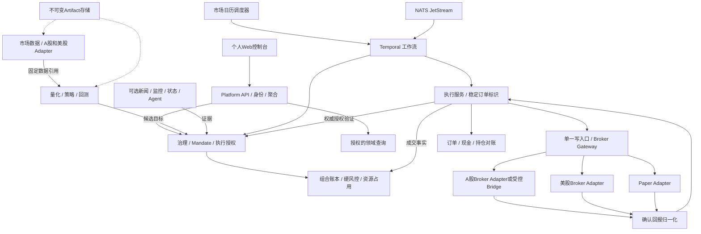

# 新项目系统架构与服务边界

版本2.0，2026-09-06。配套[PRD](./00-product-requirements.md)、[契约](./03-market-rules-and-contracts.md)、[实施计划](./04-development-plan.md)。本文件描述新项目待实现架构，目录、接口、进程均从零创建。

## 1. 架构目标与约束

仓库级细化设计集中在根目录`architecture/`：整体关系、跨服务数据/契约、部署、历史回放、12个服务及Web/FakeBroker组件。本文继续作为可独立复制PRD包的架构基线；根目录细化文档引用本包，服务边界/协议变更时同步维护，不移动或破坏本包原链接。

本轮三版扩展见[共同规则](./05-three-version-delivery.md)，保持下述服务所有权。平台API拥有验收目录/TestRun/人工证据元数据，Web提供正式页面和`/acceptance`；测试编排只能调用领域API，不写业务库。模拟券商保持独立持久状态以验证对账。

量化计算Worker负责历史回放推进与报告，执行域负责历史撮合Adapter，组合域拥有回放账本，编排服务只管理粗粒度任务/检查点；分钟Bar不逐条进入Temporal历史。业务Clock按run隔离，时刻间设置完成屏障，基础设施超时仍用真实单调时钟。Qlib快速研究与全链路回放需固定样本对照。

RD-Agent放在既有research-automation-service，不新增同义领域服务；控制器与生成代码实验Runner隔离，Web和生成代码不获得Docker Socket。本轮仅接FakeBroker，Linux ARM64日常开发与目标Ubuntu架构验证分开记录。具体契约、权限及验收见共同规则第3～8节。

面向一个人的双市场低频自动交易，优先可核验、可靠恢复和较低运维复杂度。量化、风控和账本为确定性领域；Agent和自动研究可插拔，不作为QUANT_ONLY链路的必需依赖。

使用Monorepo管理、按领域拆分微服务、生成契约通信。每个写入事实只有一个所有者，拥有独立Database/User、迁移与发布版本。可在同一PostgreSQL实例上创建多个领域数据库，但禁止跨库写入和共享ORM实体。研发从小切片开始，增强服务按需启用。

## 2. 总体关系



领域事实经Outbox发布NATS；Event Starter仅将已去重事件转换为工作流触发。Temporal保存步骤与等待，不代替业务数据库。多Leg和跨市场无分布式成交事务；业务状态通过Saga、事件与权威查询收敛。

## 3. 服务目录与事实所有权

| 服务 | 技术基线 | 唯一拥有的事实 | 入站/出站与禁止事项 |
|---|---|---|---|
| market-data-service | Python/FastAPI | Security、Calendar、MarketRuleSet来源、DataVersion、财务修订、公司行动、FX快照 | 调供应商；发布不可变数据；不访问交易账户 |
| quant-research-service | Python/FastAPI+计算Worker | 股票池、Factor/Model/Strategy Registry、分析/目标快照、回测、Outcome | 只读数据Artifact与组合快照；不创建订单 |
| portfolio-risk-service | TypeScript/NestJS | Account、PortfolioLedger、PositionLot、CashSettlement、RiskPolicy/Evaluation、ResourceReservation | 账户资源唯一写入；消费确认成交；不签发自动Mandate |
| decision-governance-service | TypeScript/NestJS | Proposal、Review关联、HumanApproval、AutomationMandate、BudgetReservation、ExecutionAuthorization、受治理经验 | 校验策略/风险/资源，签发授权；不直接连券商 |
| trade-execution-service | TypeScript/NestJS+Gateway | BrokerAccountMapping、CapabilitySnapshot、Batch/Intent/Order/Fill、ReconciliationCase、发送日志/租约 | 唯一place/query/cancel业务入口；采集券商资产快照交组合服务处理 |
| workflow-orchestration-service | TypeScript/Temporal | 调度定义、工作流配置；实际运行状态在Temporal | 编排领域命令；不直接写账本，不使用NATS替代需要确认的命令 |
| platform-api-service | TypeScript/NestJS | 本地身份/会话、偏好、通知投影、平台操作审计 | BFF鉴权/聚合/转发；不计算余额或改变订单状态 |
| news-intelligence-service（按策略启用） | Python/FastAPI | 新闻原文索引、聚类、实体关联、金融事件与修订 | 模型通过Agent网关；原文不是系统指令 |
| market-monitor-service（按策略启用） | Python/FastAPI Worker | Watchlist、MonitorPolicy、行情窗口与异常 | 只读行情；不具有交易凭证；订单级执行报价不依赖延迟研究监控 |
| market-regime-service（按策略启用） | Python/FastAPI Worker | RegimeDefinition、特征/状态快照、转换日志 | 按市场独立计算；不改RiskPolicy |
| agent-service（可选） | TypeScript通用Kernel | AgentRun、ModelRun、ContextManifest、Tool/Memory检索审计 | 六逻辑角色共用实现，不持交易或风险配置权限 |
| research-automation-service（可选） | Python API+隔离Runner | Experiment、CandidateArtifact、PromotionRequest | 只提交候选，不能激活Registry或读取交易凭证 |

执行服务拥有券商原始回报与对账案例；组合服务拥有入账事实与资源。所有权差异必须通过API/事件解决，不能由执行服务直接修改组合数据库。账户购买力源自券商快照，内部可用资源由组合服务结合未结算与占用计算，取保守允许值。

## 4. 双市场与账户分区

- 每个Portfolio初版只对应一个账户和一个市场；GlobalPortfolioView聚合多个子组合，不是可执行跨市场订单对象。
- 账户可以有多个策略子组合，但AccountResourceBook对同账户币种现金和证券数量统一加锁，防止各策略重复使用购买力。
- 证券跨市场映射保存SecurityId、market、listingVenue与brokerInstrumentId。ticker仅用于展示和适配，不可单独作为全局主键。
- A股、美股分别独立Calendar、DataVersion、StrategyDeployment、Mandate、预算交易日与对账任务；全局聚合采用明确valuationAsOf与汇率版本。
- 跨市场父计划只汇总子批次结果。一个子批次失败不自动反向平仓已完成子批次；补偿如产生新交易必须有新授权与风险检查。
- 局部故障只暂停受影响市场/账户；共享身份、全局资金或数据库一致性故障可升级全局暂停，规则在Runbook中固定。

## 5. 新项目目录模板

```text
new-project/
  README.md
  AGENTS.md
  package.json / pnpm-workspace.yaml / pnpm-lock.yaml
  apps/web/
  services/
    market-data-service/
    quant-research-service/
    portfolio-risk-service/
    decision-governance-service/
    trade-execution-service/
    workflow-orchestration-service/
    platform-api-service/
    news-intelligence-service/          # 按需
    market-monitor-service/            # 按需
    market-regime-service/             # 按需
    agent-service/                     # 可选
    research-automation-service/       # 可选
  packages/
    contracts/{openapi,asyncapi,schemas,generated-ts,generated-py}/
    config/
    observability/
    testing/
  infra/{compose,images,bridge}/
  scripts/{bootstrap,verify,backup,restore}/
  tests/{contract,integration,e2e,replay,failure}/
  fixtures/{cn,us,fx,corporate-actions,broker-events}/
  docs/product-rebuild/                # 本文档包原样复制
  docs/stages/                        # 新开发时创建各阶段设计与验收
```

所有服务内部按`domain/application/ports/adapters/bootstrap`组织。Domain不得依赖HTTP框架、Qlib、数据库SDK、Temporal、NATS或券商SDK。共享包只包含协议和基础设施工具，不持有共享可变业务状态。

每服务创建Dockerfile、迁移、README、配置Schema、测试及自己的`90-test-plan.md`/`99-acceptance.md`。API进程负责接收任务与查询，计算Worker处理重研究任务；不会在HTTP请求内执行分钟级训练。

## 6. 技术与部署决策

推荐React/TypeScript Web，TypeScript治理/组合/执行，Python数据和量化，PostgreSQL、NATS JetStream、Temporal和S3兼容Artifact存储。Qlib等研究框架放Adapter；锁定依赖和兼容矩阵后使用，不依赖浮动latest。

个人首版用Docker Compose，无需Kubernetes、服务网格或Kafka集群。生产选择满足两个市场运行时段的常开主机；可与开发使用相同镜像。Redis只作缓存/限流，不是账本、租约或审批的唯一存储。重要租约/发送状态必须持久化。

A股通道若要求特定Windows环境，部署独立受控Bridge：最小网络暴露、mTLS/签名身份、账户白名单、令牌验证、稳定订单ID、持久发送日志、状态回查和版本握手。Bridge不接收任意脚本。Broker SDK属于Bridge或执行Adapter，不能进入Web、Agent或量化进程。

不默认某个券商同时支持两市场。选型必须验证合法API权限、实盘/模拟差异、断线恢复、订单回查、成交标识、限流、会话寿命和系统约束，填入CapabilitySnapshot。仅有下单方法而无可靠状态查询不得上线自动执行。

## 7. 安全自动执行结构

每次place依次校验：服务身份→市场/账户→有效策略与Mandate或人工批准→指令Hash→有效风险评估→资金/证券占用→次数预算→最新暂停版本→有效报价→单次DispatchPermit。

DispatchPermit具有唯一ID、账户、clientOrderId、授权引用、短过期时间、pauseEpoch和fencingToken，由执行控制层持久化签发与消费。所有发往真实券商的写调用必须经过同一受控Gateway。旧Worker不能绕过Gateway直接持券商SDK凭证发单。

若券商不支持幂等clientOrderId，不能宣称网络写入exactly-once。响应丢失时保存UNKNOWN并通过券商查询/成交/人工核对确认；无法确认时维持暂停和占用。只有权威证据明确未接受时才可重试。

暂停与实际网络发出不可跨网络原子化。产品保证：暂停提交后不再签发新的DispatchPermit；暂停前已消费令牌的请求可能在途，必须显示、查询并按需撤单。紧急场景由Gateway关闭新写入，不能承诺交易所立即撤销已接受订单。

## 8. 事件、一致性与存储

业务聚合、命令幂等记录和Outbox同事务。Outbox Relay发布事件失败可重试，不能在数据库事务里等待总线。消费者Inbox(eventId)与其业务副作用同事务，提交后ACK。重复投递、乱序、迟到和回放均有明确处理。

对同聚合按aggregateVersion拒绝过时推进；缺口先缓冲/回查，不默认跳过。跨服务Saga使用稳定请求ID，不依赖内存Map在重启后恢复。长Artifact存内容寻址对象，元数据和latest指针原子发布；失败保留旧结果并标陈旧。

执行账本不允许物理覆盖纠错。原始券商回报保留Hash和来源；归一化Fill以增量数量入账；更正事件指向原Fill。账户冻结、费用更正、未识别成交和外部手动订单走ReconciliationCase，不能当普通可重试HTTP错误。

## 9. 故障与降级矩阵

| 故障 | 读能力 | 新交易 | 恢复方法 |
|---|---|---|---|
| 研究历史数据不可用 | 旧快照可读且标陈旧 | 依赖此数据的新策略信号禁止 | 重新导入固定版本并重算 |
| 执行报价/账户陈旧 | 显示年龄和来源 | 对应账户/市场禁止 | 新报价/同步账户，重新风控 |
| 硬风控/授权不可用 | 尽可能只读 | 失败关闭 | 恢复权威服务并重检版本 |
| 一个券商离线 | 保留最后状态，不标订单失败 | 暂停该通道 | 查询所有在途、对账后恢复 |
| NATS/Temporal暂不可用 | 领域查询继续 | 不依赖未确认流程推进 | Outbox与工作流恢复，不重发交易 |
| 可选Agent不可用 | QUANT_ONLY正常；必需Agent策略标阻塞 | 不切模式绕过必需证据 | 恢复或本人发布新的策略配置 |
| 进程租约丢失 | 旧进程可只读 | Gateway拒绝旧fencingToken | 新发送者恢复日志并查询 |
| 备份恢复后数据落后 | 暂停显示恢复状态 | 全部禁止 | 拉取券商缺失订单/成交，补账对账 |
| 时钟漂移/睡眠 | 显示断档 | 不集中补单 | 同步时钟、会话、日历与账户后重评 |

## 10. 可观测性与操作文档

日志/Trace贯通ownerId、market、accountId、portfolioId、strategyVersion、proposalId/version、batchId、clientOrderId、fillId及correlationId；不记录明文凭证。指标包括行情/账户年龄、队列/Outbox滞后、Mandate拒绝率、UNKNOWN数量、对账差异、时钟漂移和Gateway租约。

`/live`仅进程存活，`/ready`返回依赖与已启用能力，`/version`含代码/契约版本，`/metrics`返回可采集指标。不能以HTTP200推断自动交易已准备就绪。

新项目必须编写启动、通道验证、实盘启用、暂停、未知订单恢复、外部成交认领、备份恢复、公司行动处理和版本回滚Runbook。每个Runbook包含前置条件、操作步骤、成功指标、停止条件和审计字段。
